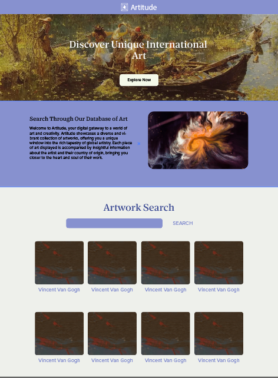

# Artitude

## Description

Artitude is a online art database for the Chicago Institute of Art. Use this site to search for art by keyword, artist, region, etc and gain further information on artist and place of origin. 
Clicking on an art card will give you further information about the artist or time period if no artist info present, a map of the artwork's place of origin and the art itself. 

Live Link:
[https://zaczacariah.github.io/Artitude/]

## Screenshot

## Installation

N/A

## Usage

For browsing of artwork and gaining a greater understanding of artists and origin. 

## Credits
 N/A

## License

Please refer to the LICENSE in the repo.
 
